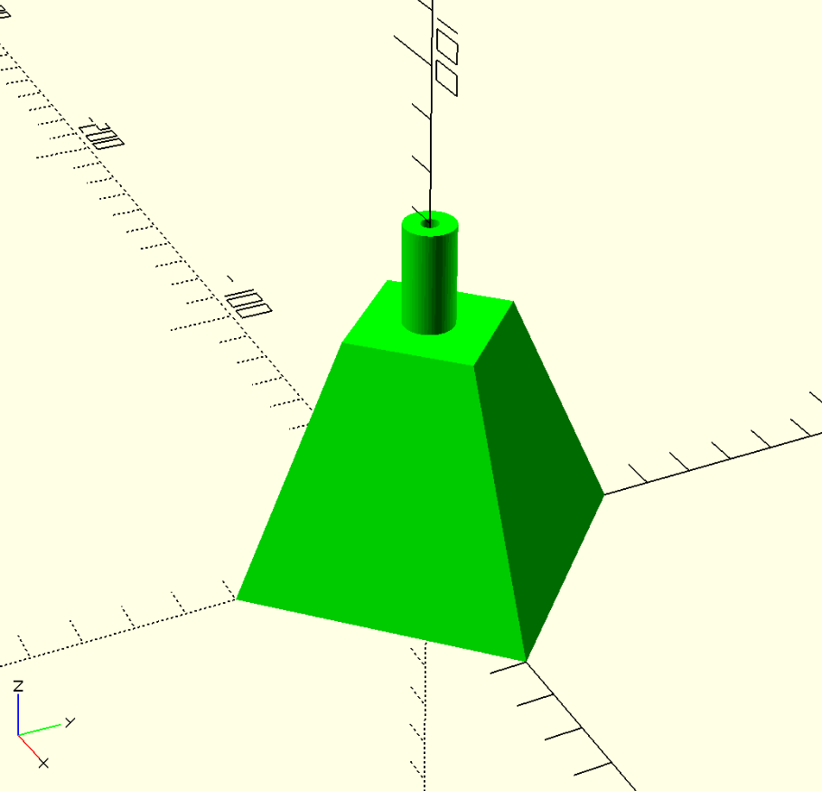

# ARUCO tags

This repository contains few ARUCO tags to be easy printed.

## Build

Using [just](https://just.systems/) the default recipe will create an
ARUCO tag using `ARUCO_MIP_36h12` dictionary with id 0.

To create a different id, for example id 1, use:

```shell
just id=1 build
```

You can also change size and don't print the caption:

```shell
just id=0 size=5.5cm is_caption_enabled=false build
```

> [!NOTE]
> The tags in SVG format used have a white border so when you specify, for
> example, 5.5cm you are including this white border.

## 3D base for the tags

In the [extras](extras) directory you can find a 3D model made with OpenSCAD
that can be used as base for the tags. It's made to be used with a wooden
skewer. The default hole on the top is 3.5mm, you have to change it if you
can't find a suitable wooden skewer.


